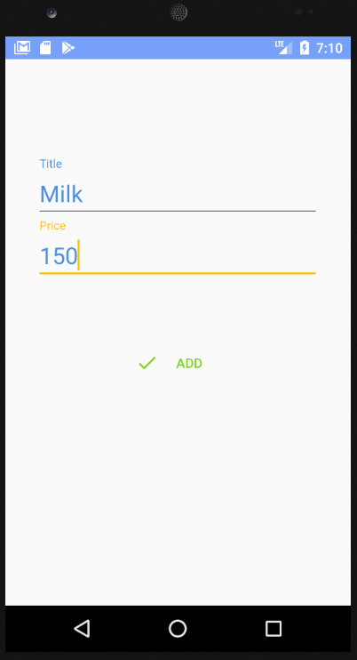

School project for LoftSchool
# LoftMoney
Мобильное приложение для учета финансов.

|  |  |  |
| ---------------------------------------------- | -------------------------------------------- | ------------------------------------------- |

## Из чего состоит

Приложение состоит из двух activity - активити добавление новых расходов/доходов и активити основного экрана.

На основном экране 2 фрагмента, они связаны между собой **TabLayout**'ом и **ViewPager**'ом.

К одному из фрагментов подвешен **RecyclerView**

Диаграмма финансов создавалась с помощью **CustomView**

### Технологии, используемые в проекте
**gradle** - для сборки проекта.
**retrofit**, **okhttp**, **rxjava2** - для работы с сетью.

